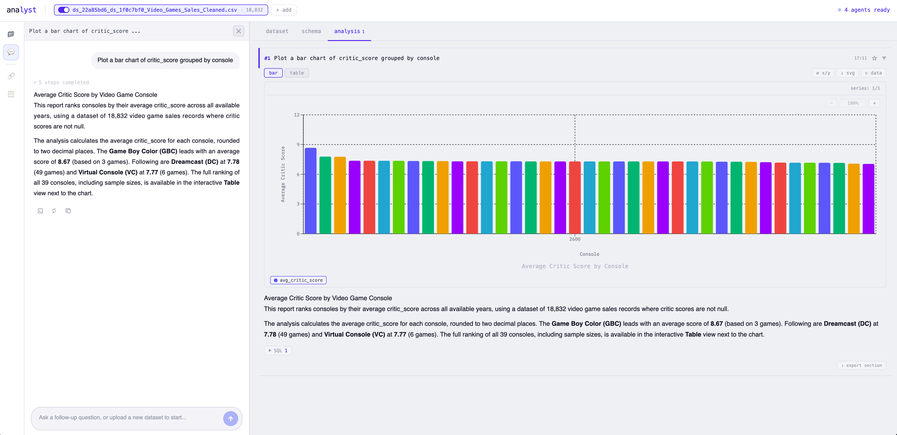
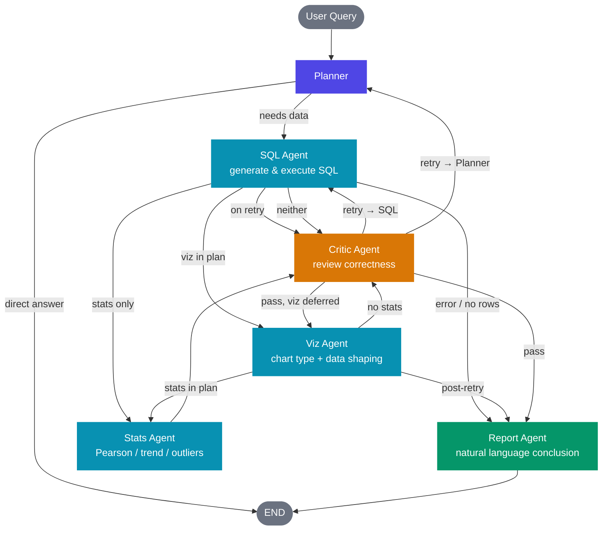

# c2d — Chat to Dataset

A multi-agent AI system for natural language data analysis. Upload a CSV or Excel file, ask questions, and get SQL queries, interactive charts, statistical tests, and a written report — all generated automatically.



---

## Features

- **Natural language queries** — supports English and Chinese
- **Multi-agent pipeline** — Planner → SQL → Viz → Stats → Critic → Report
- **Auto chart selection** — picks the right chart type (bar, line, pie, scatter, histogram) from query intent
- **Statistical analysis** — Pearson correlation, trend significance, outlier detection (Z-score / log+IQR adaptive)
- **Self-correction** — a Critic agent reviews results and triggers retries when the output looks wrong
- **Streaming responses** — real-time progress updates via Server-Sent Events
- **NULL handling** — detects sparse columns and lets users configure imputation strategy before querying
- **Multi-table support** — load and join multiple datasets in the same session
- **Multiple LLM providers** — DeepSeek (default), OpenAI-compatible, Anthropic Claude, or local Ollama

---

## Architecture



**Key routing rules:**
- **Direct answer** — Planner detects schema-only questions (column names, dataset description) and answers without running SQL
- **SQL error / empty result** — skips Viz, Stats, and Critic; goes straight to Report for error handling
- **Retry loop** — Critic can send the pipeline back to SQL Agent or Planner with feedback; on retry, Viz/Stats are skipped until Critic passes, then Viz runs as a deferred step if it was in the original plan
- **Viz/Stats are optional** — only activated when the Planner's plan includes them based on query intent

**Backend** — Python / FastAPI / LangGraph  
**Frontend** — React / TypeScript / Vite  
**Data engine** — DuckDB (in-process, no external DB required)  
**LLM orchestration** — LangChain + LangGraph  

---

## Tech Stack

| Layer | Technology |
|---|---|
| Backend framework | FastAPI + Uvicorn |
| Agent orchestration | LangGraph + LangChain |
| Data engine | DuckDB + Pandas |
| Statistics | SciPy + scikit-learn |
| Charts | Plotly (server) + Recharts (client) |
| Vector search | Qdrant + sentence-transformers |
| Frontend | React 19 + TypeScript + Vite |
| State management | Zustand |
| Streaming | Server-Sent Events (SSE) |
| LLM providers | DeepSeek / OpenAI-compat / Anthropic / Ollama |

---

## Prerequisites

- Python 3.12+
- Node.js 18+ and pnpm (or npm)
- An API key for your chosen LLM provider

---

## Setup

### 1. Clone the repository

```bash
git clone https://github.com/yuting-ai/c2d.git
cd c2d
```

### 2. Configure environment variables

```bash
cp .env.example .env
```

Edit `.env` and set your LLM provider credentials:

```env
# LLM Provider: "deepseek" | "anthropic" | "ollama"
LLM_PROVIDER=deepseek
LLM_MODEL=deepseek-chat
DEEPSEEK_API_KEY=your_key_here

# Or use Anthropic
# LLM_PROVIDER=anthropic
# LLM_MODEL=claude-opus-4-6
# ANTHROPIC_API_KEY=your_key_here

# Or use a local Ollama model
# LLM_PROVIDER=ollama
# OLLAMA_MODEL=qwen2.5-coder:7b
```

### 3. Install backend dependencies

Using [uv](https://github.com/astral-sh/uv) (recommended):

```bash
uv sync
```

Or with pip:

```bash
pip install -e .
```

### 4. Install frontend dependencies

```bash
cd frontend
pnpm install
```

---

## Running

### Development mode

Start the backend (from project root):

```bash
uvicorn backend.api.main:app --reload --port 8000
```

Start the frontend (from `frontend/`):

```bash
pnpm dev
```

The app will be available at `http://localhost:5173`.

### Production build

```bash
# Build frontend
cd frontend && pnpm build

# Serve backend (frontend is served as static files or via a reverse proxy)
uvicorn backend.api.main:app --host 0.0.0.0 --port 8000
```

---

## Usage

1. **Upload a dataset** — drag and drop a CSV or Excel file (.xlsx) into the sidebar
2. **Inspect schema** — review column types, row counts, and NULL sparsity warnings
3. **Configure NULL handling** — choose how to treat sparse columns (mean, median, exclude, or keep NULL)
4. **Ask a question** — type any natural language question about your data
5. **View results** — the panel shows the generated SQL, charts, statistical tests, and a written report

### Example queries

```
Show the top 10 products by total sales
What is the monthly revenue trend for 2023?
Is there a correlation between price and units sold?
Which regions have the highest average order value?
Show the distribution of customer ages
Compare Q1 vs Q2 sales across all categories
```

---

## API Reference

The backend exposes a REST + SSE API:

| Method | Endpoint | Description |
|---|---|---|
| `GET` | `/api/health` | Health check |
| `POST` | `/api/projects` | Create a new project |
| `GET` | `/api/projects/{id}` | Get project details |
| `POST` | `/api/projects/{id}/datasets` | Upload a dataset |
| `GET` | `/api/projects/{id}/datasets` | List datasets |
| `POST` | `/api/projects/{id}/analyze` | Run analysis (SSE stream) |
| `GET` | `/api/projects/{id}/history` | Get query history |

Interactive API docs available at `http://localhost:8000/docs` when the backend is running.

---

## Project Structure

```
c2d/
├── backend/
│   ├── agents/          # Multi-agent pipeline
│   │   ├── planner.py       # Intent classification & agent routing
│   │   ├── sql_agent.py     # SQL generation & self-correction
│   │   ├── viz_agent.py     # Chart type selection & data shaping
│   │   ├── stats_agent.py   # Statistical tests (Pearson, trend, outliers)
│   │   ├── critic_agent.py  # Result quality review
│   │   └── report_agent.py  # Natural language conclusion synthesis
│   ├── api/             # FastAPI routes, schemas, SSE
│   ├── config/          # Settings and LLM prompt templates
│   ├── db/              # DuckDB engine, data loader, sandboxed execution
│   ├── graph/           # LangGraph pipeline, state, routing
│   ├── knowledge/       # DuckDB RAG retriever
│   ├── memory/          # Session memory and user preferences
│   └── tools/           # SQL, stats, viz, and data tools
├── frontend/
│   ├── src/
│   │   ├── components/  # React UI components
│   │   ├── hooks/       # Custom hooks (streaming, resizer, navigation)
│   │   ├── stores/      # Zustand state stores
│   │   ├── styles/      # Global and component CSS
│   │   └── utils/       # Export helpers, connectivity, zip
│   └── index.html
├── pyproject.toml       # Python dependencies
└── .env                 # Environment variables (not committed)
```

---

## Configuration Reference

All settings can be overridden via `.env`:

| Variable | Default | Description |
|---|---|---|
| `LLM_PROVIDER` | `deepseek` | LLM backend (`deepseek`, `anthropic`, `ollama`) |
| `LLM_MODEL` | `deepseek-chat` | Model name for the chosen provider |
| `DEEPSEEK_API_KEY` | — | DeepSeek API key |
| `ANTHROPIC_API_KEY` | — | Anthropic API key |
| `OLLAMA_BASE_URL` | `http://localhost:11434/v1` | Ollama server URL |
| `OLLAMA_MODEL` | `qwen2.5-coder:7b` | Ollama model name |
| `EMBEDDING_PROVIDER` | `local` | Embedding backend (`local`) |
| `EMBEDDING_MODEL` | `all-MiniLM-L6-v2` | Sentence-transformer model |
| `QDRANT_HOST` | `localhost` | Qdrant vector DB host |
| `QDRANT_PORT` | `6333` | Qdrant vector DB port |
| `DUCKDB_DATA_DIR` | `./data/processed` | DuckDB database storage path |
| `UPLOAD_DIR` | `./data/uploads` | Uploaded file storage path |
| `HOST` | `0.0.0.0` | Backend server bind address |
| `PORT` | `8000` | Backend server port |

---

## Environment Variable Template

Create a `.env.example` file for reference:

```env
LLM_PROVIDER=deepseek
LLM_MODEL=deepseek-chat
DEEPSEEK_API_KEY=

ANTHROPIC_API_KEY=

OLLAMA_BASE_URL=http://localhost:11434/v1
OLLAMA_MODEL=qwen2.5-coder:7b

EMBEDDING_PROVIDER=local
EMBEDDING_MODEL=all-MiniLM-L6-v2

QDRANT_HOST=localhost
QDRANT_PORT=6333
QDRANT_COLLECTION=c2d_memory

DUCKDB_DATA_DIR=./data/processed
UPLOAD_DIR=./data/uploads
EXPORT_DIR=./data/exports

HOST=0.0.0.0
PORT=8000
DEBUG=false
```

---

## License

MIT
